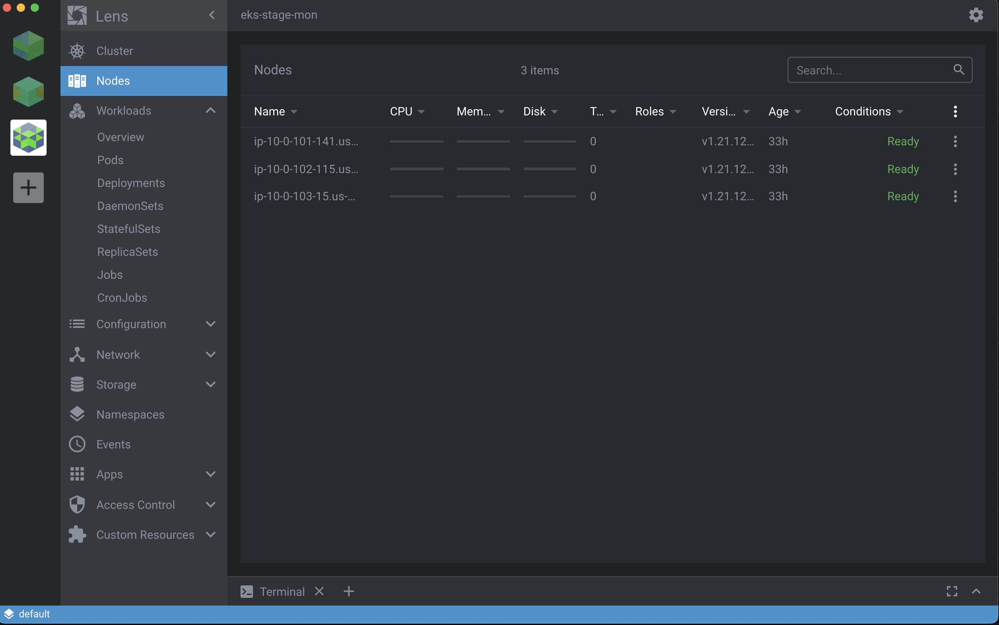
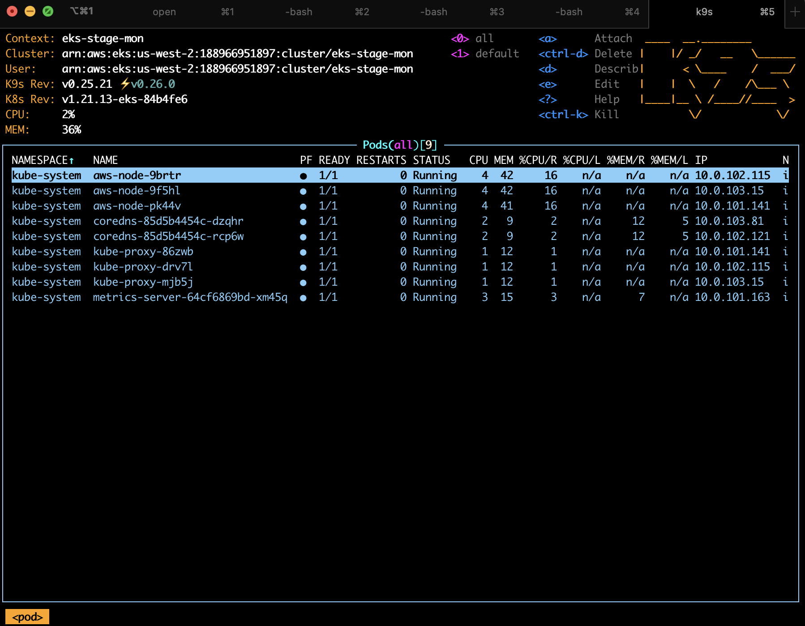

# Kubernetes Observability and Monitoring

If you've already completed part one of this class you'll have a cluster up that is ready to roll! If not, you'll need to get it all ready for the class. Let's get caught up


## 01. Set up Basic EKS

We have an EKS terragrunt plan in [../02/terragrunt/live/stage-mon](../02/terragrunt/live/stage-mon).  To start run: 

```
terragrunt run-all apply 
```

This will set up the basic cluster you'll need as well as OpenSearch that we'll use for the logging portion of this class at the end. 

You should then add the cluster to your kube config with: 

```
aws eks update-kubeconfig --name eks-stage-mon \
	--alias eks-stage-mon \
	--role-arn arn:aws:iam::188966951897:role/eks_dude_role
```

## 02. Kubernetes Additional Users

Once you can access you're Kubernetes cluster you need to add the ingress controller, associate with Route 53, and then add the cert-manager components: 

```

```

```
kubectl edit cm -n kube-system aws-auth
```


Add: 

```
- groups:
      - system:masters
      rolearn: arn:aws:iam::188966951897:role/eks_dude_role
      username: devops:{{SessionName}}
```

## 03. Metrics API 

We can install the metrics API that we mention in [part 5](../05/metrics-server-0.6.1).  

```
kubectl apply -f 05/metrics-server-0.6.1/
```

Once this is done we should be able to run: 

```
kubectl top nodes
kubectl top pods -A 
kubectl get —-raw /metrics
```


## 04. Basic Monitoring with Lens

Get [Lens](https://k8slens.dev/) and install and open.  It should read your `~/.kube/config` and be able to open up a session. 



Have a look around and notice if there are any issues. 

## 05. K9s

Install [k9s](https://k9scli.io/topics/install/). k9s uses your current context to show your cluster and monitor different components. 



# Section 1 WrapUp

Cool, we now have a basic cluster, metrics are enabled and we have two different dashboard options we can look at to monitor our cluster.  Lens is great especially if you're not into remembering Kubernetes commands and just want a clean IDE to look at. 