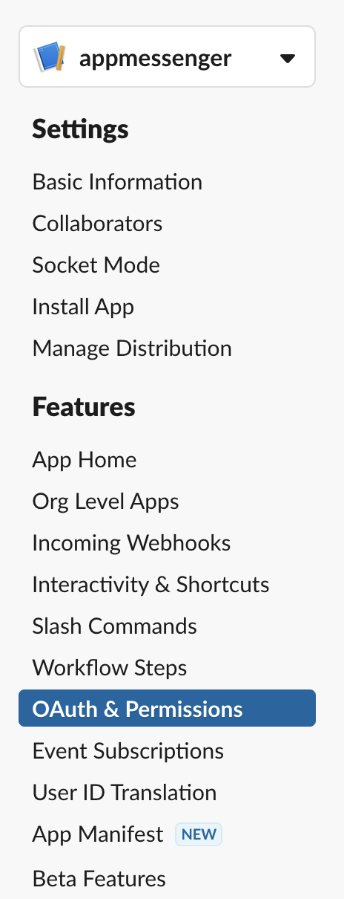
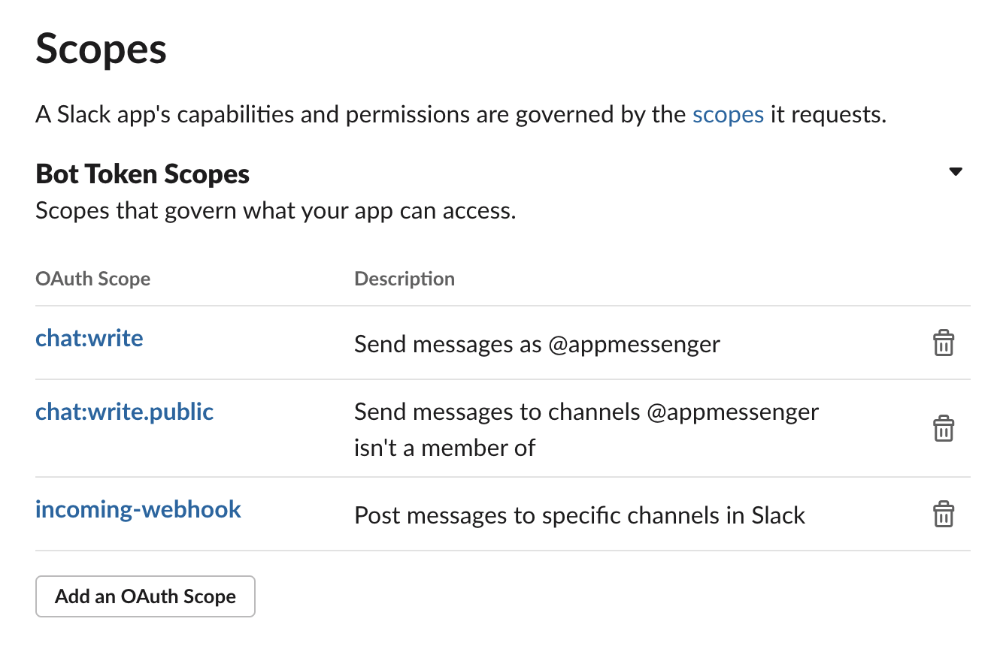

# Basic Application

We need to get our application ready so we can see about application alerts. 

If you haven't done the first modules in the first class, then we need to quickly get the cluster to be able to hold an application: 

```
cd 04
apply -f nginx-ingress-controller/deploy.yaml
kubectl apply -f cert-manager/cert-manager.yaml
```

Modify the DNS name to match the Load Balancer

```
kubectl apply -f cert-manager/prod-issuer.yaml
```


## External Secrets

We will also need external secrets to store our passwords for our application. 

This includes database permissions, slack APIs, etc.  The cost to store this in AWS Secrets manager is $0.40/month.  


```
helm repo add external-secrets https://charts.external-secrets.io

helm install external-secrets \
   external-secrets/external-secrets \
    -n kube-system \
    --create-namespace \
    --set installCRDs=true
```


## Modifying the application for Slack

We first need to create a Slack Application and get a token for posting to our Slack messages. 

I find this process extremely not-straightforward, but the idea is you must: 

1. Create an application
2. Create give the application permissions to post messages
3. Install the application in your workspace.

When you create the application you can go to the applications dashboard [https://api.slack.com/apps/](https://api.slack.com/apps/) and hopefully find the `OAuth & Permissions` section. 



From there add the bot permissions: 



You should add: 

* `chat:write`
* `chat:write:public` - this way you can write to any channels in the workspace. 

We now should have the `Bot User OAuth Token` on this same page.  This is the token we will save in our environment as `SLACK_TOKEN`.  We also need to create a channel and then get the channel so we can post there.  

This is done by right clicking on a channel's info button and copying the channel id)


Clicking in the channel information button you can get the Channel ID down at the bottom. 


For development I put these in my `~/.zshrc` or `~/.bash_profile` (depending on shell) so it looks like: 

```
export SLACK_TOKEN=xoxb-28...
export SLACK_CHANNEL=C03NPPVGR3R
```
Now I can develop this locally.

In the app directory, let's edit the [docker-compose.yaml](../app-api/docker-compose.yaml) file and add the following to the environment variables: 

```
		- SLACK_TOKEN=${SLACK_TOKEN}
		- SLACK_CHANNEL=${SLACK_CHANNEL}
``` 
This allows us to grab the slack environment variables. 

Notice iside the application there is a slack library called [slack.py](../app-api/app/lib/slack.py) where we can create a client and send messages to slack.  

We want to be alerted when a new user signs up successfully.  Let's alert on that by modifying the backend sign up.  This is done by opening the file: 

[app/routers/auth.py](../app-api/app/routers/auth.py).  We add the following lines after a user is created: 

```
sc = SlackClient()
sc.post_message(f"New Customer signed up: {user.email}")
```

To keep data private you may want to put the user id or some other value for this.  Let's try this out. 

```
cd app-api
make dev
```

This will run locally.  To get the front end locally, open another browser and run: 

```
yarn install
yarn start
```


