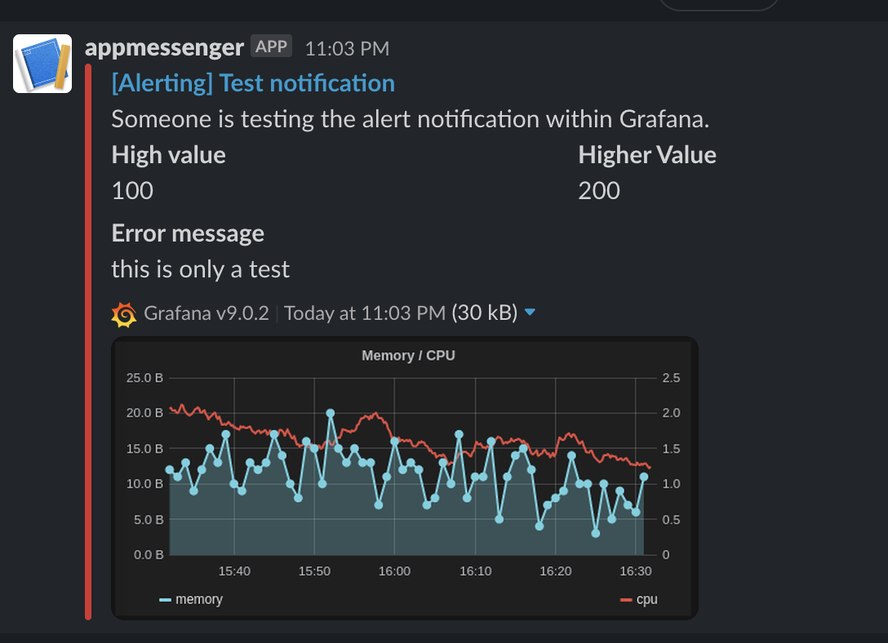

# Grafana

While Prometheus has some great metrics and even shows some graphs, Grafana is a far more powerful place to feed all these graphs and visualize them.  In addition to that, there is a community that has already made many graphs you might want to use for your cluster.  These graphs can help you understand everything in your environment.  

Grafana is already part of the Prometheus stack we installed in the previous section.  But let's configure it here so we can see some cool things. 

```
helm upgrade --install -n monitoring \
	kube-prom -f prom-stack-with-grafana.yaml \
	prometheus-community/kube-prometheus-stack \
	--version 37.2.0
```

## Customizations


## Logging In

We encoded it with a password `castlerock / secret` like the previous dashboards.  We can explore the given dashboards that accompany the default installation under browse.  This shows us Kubernetes resources in an easy to understtand graph. 


These are great because they are installed by default.  


## Adding Slack

```
kubectl apply -f slack-notifier.yaml
```


```
kubectl rollout restart -n monitoring deployment kube-prom-grafana
```
Now we see the slack notification is present.  We can test it using the test button. 


This gives us an alert in slack



Now we can set an alarm if something goes bad to notify us in slack. 


