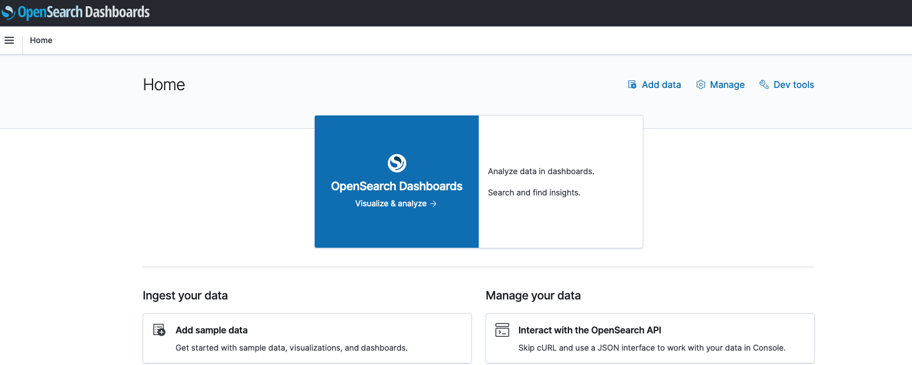

# The FEK Stack

Logging information from your applications to search, verify, and index on is a great idea and gives added visibility.  In a production environment developers are constantly looking at logs to analyze user behavior, what went wrong, and find ways to improve the system. 


## Components

* Fluentd - This is the workhorse that gathers the logs from the system and then forwards them on to a centralized place.  But it can do more than that, it can forward logs to multiple places, transform them in place, and do other fancy tricks. 
* ElasticSearch (OpenSearch) - ElasticSearch is open source and the company behind them (Elastic) seemed to have issues with Amazon.  So Amazon forked it, and now offers OpenSearch.  Good or bad, this is what we'll use. 
* Kibana - This is our dashboard for viewing the logs and keeping them sorted. 

## Installation and Configuration

### OpenSearch

The first step is to install an OpenSearch Cluster.  We'll keep it small to start out with but notice how big these things can get, so watch it.  The other thing to watch for is that the logs constantly fill up!  We have implemented a culler in the past that culls these logs and clears out everything. 

The OpenSearch was installed as a terragrunt module before the course started. 

But now we'd like to access OpenSearch.  As it is going in through our private subnet we have no access to it from the outside.  However, we can make a password protect ingress rule that can allow us access to the kibana service.  

To do this we create a service with an [ExternalName](https://kubernetes.io/docs/concepts/services-networking/service/#externalname) that maps to OpenSearch.  

Then we create an ingress rule and now we have access to the kibana dashboard.  

```
kubectl apply -f kibana-proxy.yaml
```

This lets us login with our standard username/password and now we can visit: 

[https://kibana.k8s.castlerock.ai/_dashboards](https://kibana.k8s.castlerock.ai/_dashboards) and see our OpenSearch cluster



There's not much to see in here right now because there is


### Fluentd

```
helm repo add fluent https://fluent.github.io/helm-charts
helm repo update
```

We will be adding our own values yaml to install this so that it forwards to our Elasticsearch cluster. 

You can see all the values that can be configured with: 

```
helm show values fluent/fluentd
```

```
kubectl create ns fluentd
helm upgrade --install -n fluentd fluentd -f values.yaml fluent/fluentd
```

